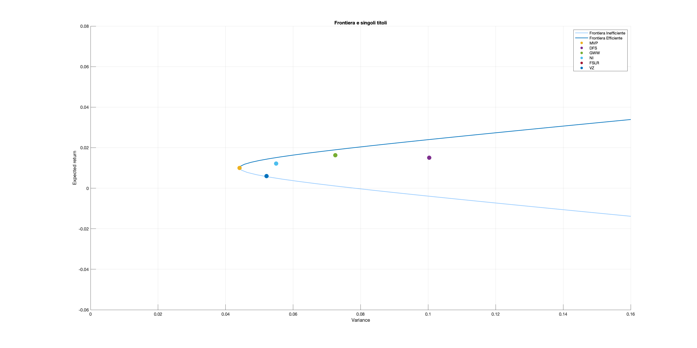
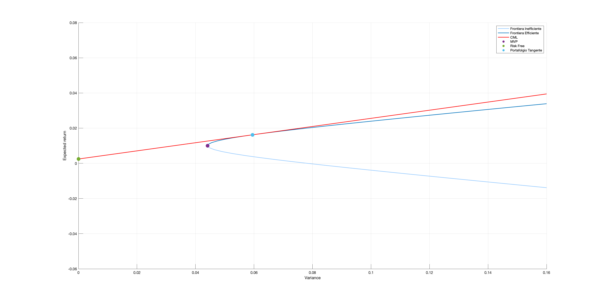
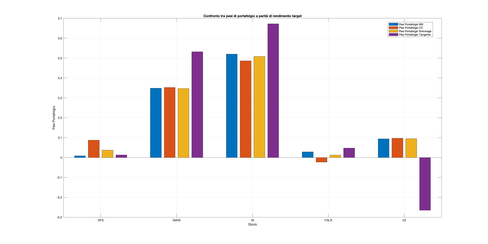
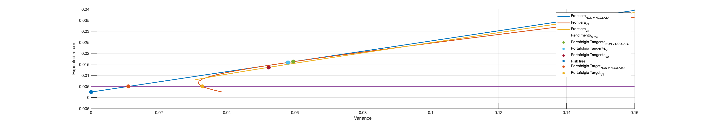
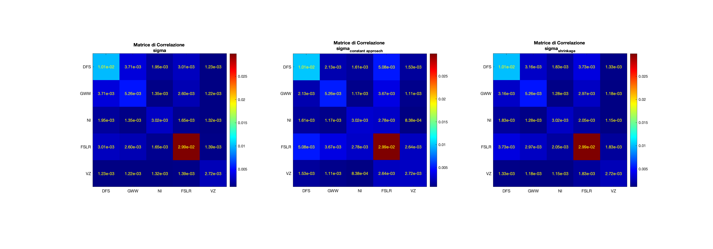
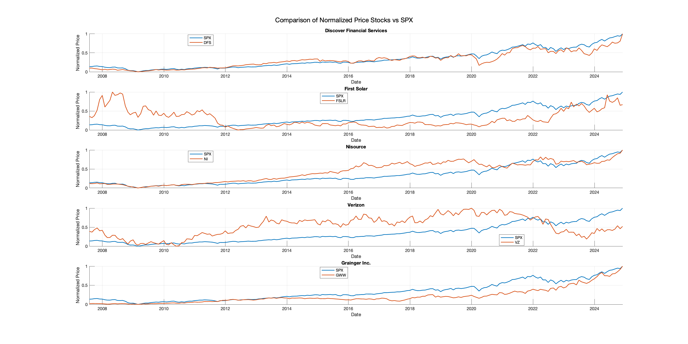
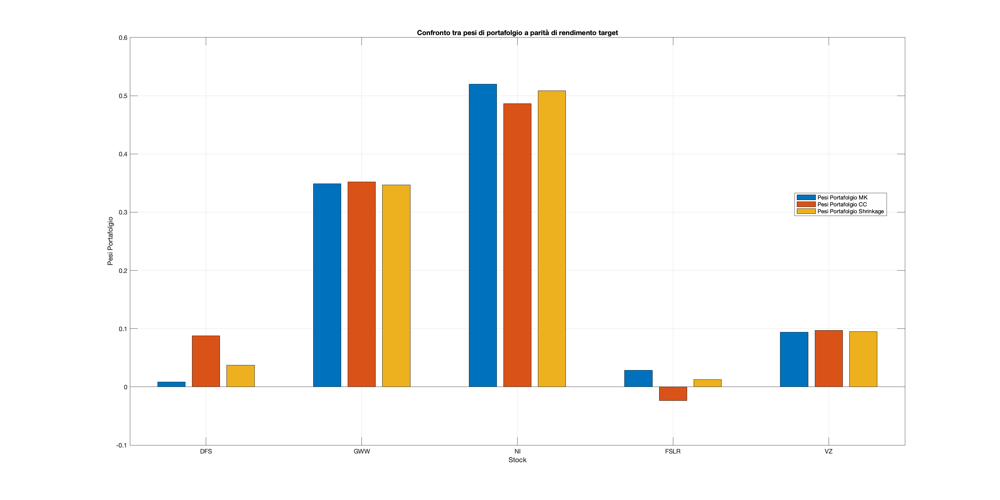
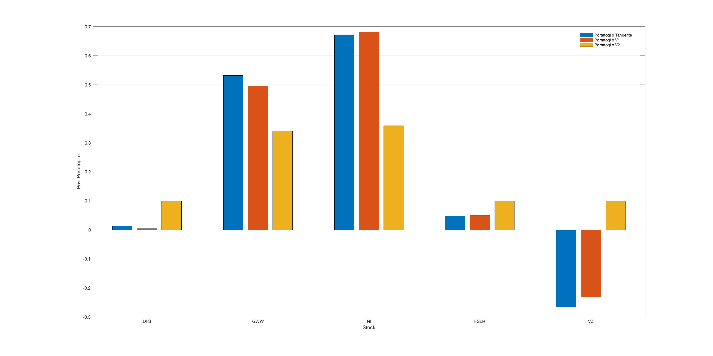

# Portfolio Optimization on S&P 500 Subset

This project was developed during the MSc in Quantitative Finance at POLIMI Graduate School of Management (2024–2025).  
It implements a full portfolio construction pipeline using real stock data from five S&P 500 companies, combining classical and advanced asset allocation techniques.

## Repository Structure

## Code Overview

Scripts are located in [`code/`](code):

- `Report.m` – End-to-end implementation of the project:  
  - Imports and cleans financial time series (prices, returns, market cap)  
  - Performs normality and distribution analysis  
  - Estimates covariance matrices (sample, constant correlation, shrinkage)  
  - Computes efficient frontiers using Markowitz theory  
  - Constructs tangency portfolios (unconstrained and constrained)  
  - Applies CAPM regression to estimate alphas and betas

- `BlackLitterman.m` – Implementation of the Black-Litterman model:  
  - Formulates investor views on relative performance  
  - Applies the Black-Litterman posterior expected returns  
  - Computes new optimal portfolio weights  
  - Visualizes asset allocation and risk-return tradeoffs

## Figures

All visual outputs are stored in [`figures/`](figures). Below are the key plots:

| Image | Description |
|-------|-------------|
|  | Efficient frontier (Markowitz), Minimum Variance Portfolio |
|  | Capital Market Line with risk-free asset |
|  | Weights of the tangency portfolio |
|  | Efficient frontiers with long-only constraints |
|  | Sample vs shrinkage vs constant-correlation covariance |
|  | Relative price evolution vs S&P 500 |
|  | Comparison of log and classic returns |
|  | Portfolio allocation under different assumptions |
|  | Portfolio weights from Black-Litterman model |

## Data

Input files in [`data/`](data) include adjusted closing prices and total returns for:

- Discover Financial Services (DFS)
- Grainger Inc. (GWW)
- Nisource (NI)
- First Solar (FSLR)
- Verizon (VZ)
- S&P 500 Index (SPX)

These are used to compute return matrices, covariance estimates, and for CAPM calibration.

## Report

The full academic report is available here:  
[`report/Cettolin_Gestione_Portafogli.pdf`](report/Cettolin_Gestione_Portafogli.pdf)

---

> *Created by Francesco Cettolin – MSc Quantitative Finance @ POLIMI (2024–2025)*
